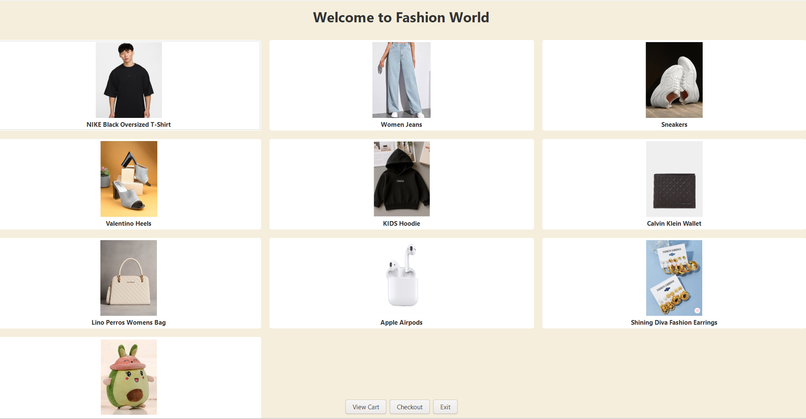
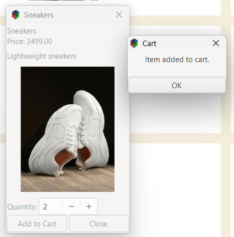
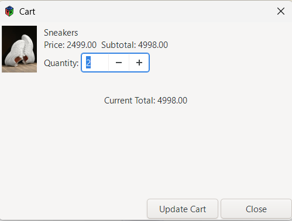

# Online Shopping System (Fashion World)

A desktop-based Online Shopping application developed using **C** and **GTK GUI library**.

## Features
- Product catalog with images
- Graphical user interface
- Add to cart functionality
- Update or remove cart items
- Checkout system
- Order processing using **Queue**
- Cart management using **Doubly Linked List**

## Technologies Used
- C Programming
- GTK (GUI Toolkit)
- Data Structures
- Windows Environment

## Screenshots

### Home Page

### Product Details

### Cart Page

## How to Run
1. Install **GTK library**
2. Compile using GCC  gcc src/main.c `pkg-config --cflags --libs gtk+-3.0` -o shop
3. Run the executable file  ./shop

## Author
**Sreeja M**
